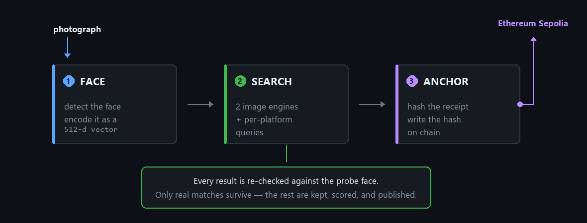
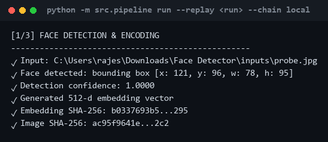
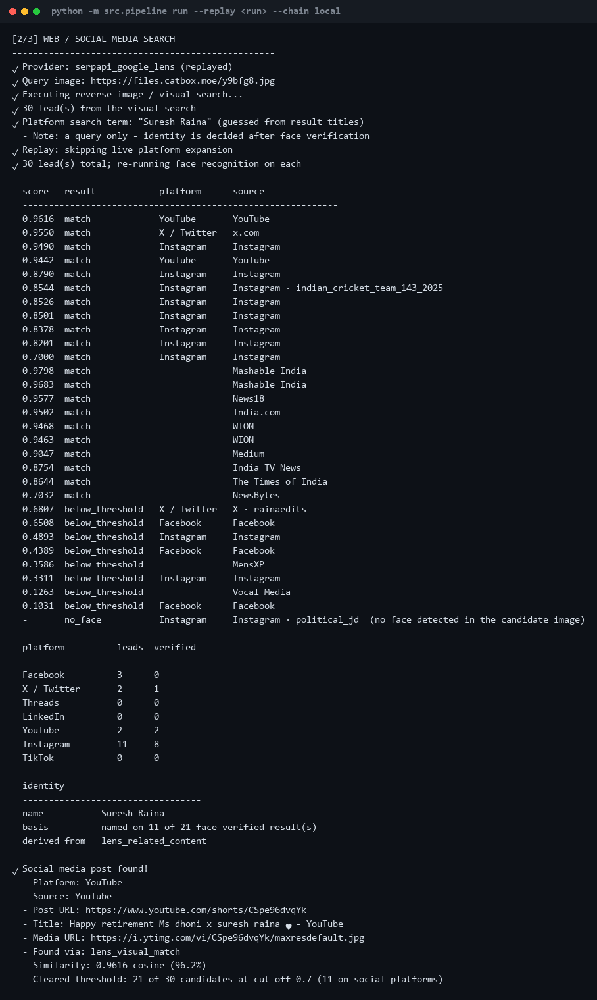
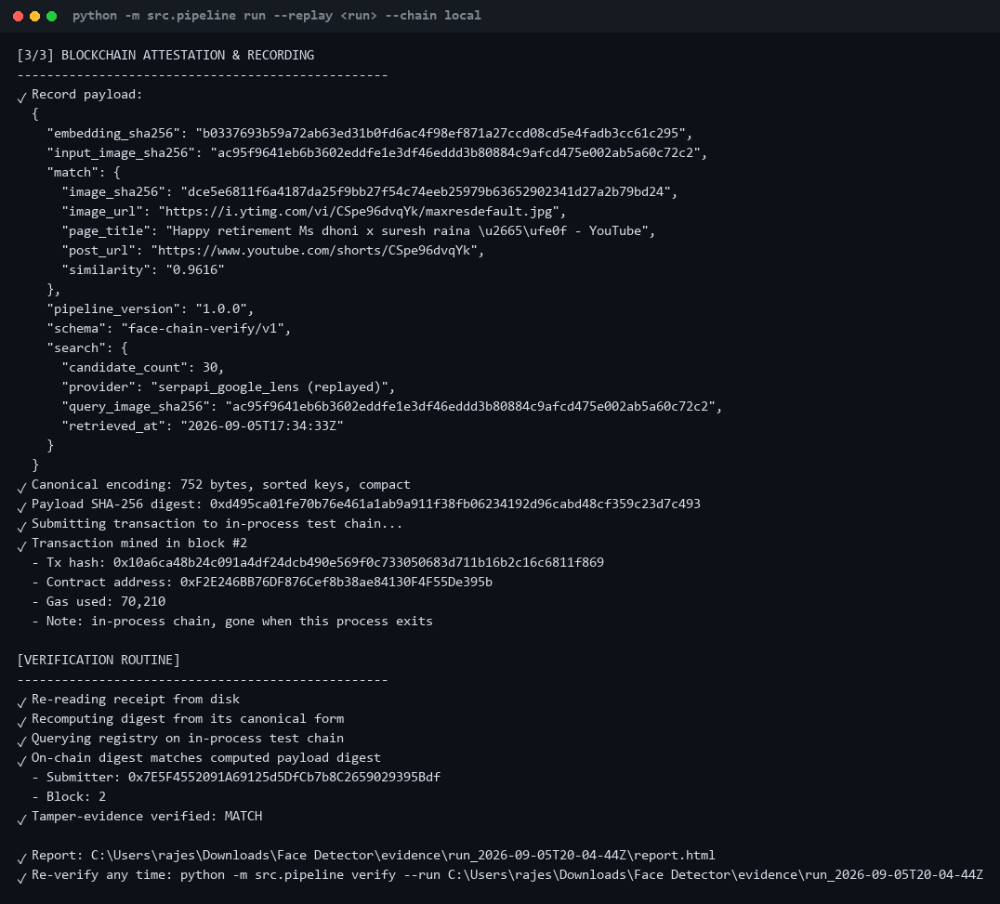
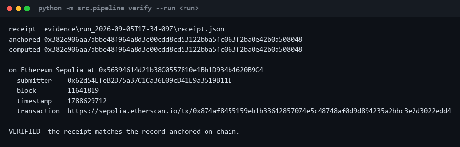
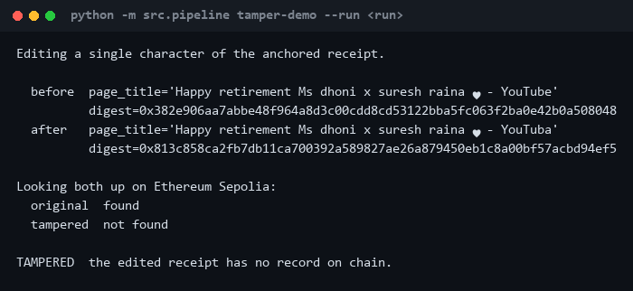

# Face Detector

**Give it a photograph of a face. It finds that person's social media post, then
records the discovery on a public blockchain so nobody can alter it afterwards.**



Seven platforms are searched deliberately: **Facebook · X · Threads · LinkedIn ·
YouTube · Instagram · TikTok**

---

## Try it yourself — no API key, no wallet, no gas

All three commands work on a clean clone with **no `.env` and no configuration**.
Only [Install](#install) is needed first.

| Command | What it proves |
| --- | --- |
| `run --replay …` | the whole pipeline, end to end |
| `verify --run …` | a real Sepolia record still matches |
| `tamper-demo --run …` | changing one character breaks it |

```bash
python -m src.pipeline run --replay evidence/run_2026-09-05T17-34-09Z --chain local
```

Replay re-executes every stage against a committed search response. Real face
detection, real downloads, real scoring, real contract — it just does not spend
a search credit or any gas.

---

## How it works

### Stage 1 — Detect and encode the face



MTCNN finds the face and crops it. A second model turns that crop into **512
numbers** — a numeric fingerprint of the face.

Two photographs of the same person land close together in that space. Two
different people land far apart. Comparing faces is then just comparing numbers.

### Stage 2 — Search the web, then re-check every result by face



A reverse image search only finds copies of the *same file*. So its results are
treated as **leads, not answers**.

Every candidate image is downloaded, embedded, and scored against the probe.
That is what lets the pipeline match a *different photograph* of the same person
— and reject the lookalikes a visual search returns alongside.

Three things to notice in the output above:

- **Rejects are printed, not hidden.** An X post scored **0.6807** and was
  rejected. A hardcoded answer would have nothing to reject.
- **Every target platform is reported**, including the ones that found nothing.
  "Searched and found nothing" is a more honest statement than silence.
- **The name is a query, not a claim.** It is used to build `site:` searches.
  Identity is only reported after the face check has ruled on every candidate.

### Stage 3 — Anchor the finding on chain



The receipt is serialised to a canonical form — sorted keys, no whitespace,
floats as strings — so the same receipt hashes identically on any machine.

Only that **hash** goes on chain. No image, no embedding, no name is ever
published. The run then immediately re-reads the receipt from disk and re-checks
it, so a receipt that could not reproduce its own digest is caught at once.

---

## Prove it has not been altered

Recompute the digest from the stored receipt and look it up on Sepolia. No key,
no wallet, no gas — `verify` reads a public endpoint.

```bash
python -m src.pipeline verify --run evidence/run_2026-09-05T17-34-09Z
```



Now change **one character** of that receipt and try again:

```bash
python -m src.pipeline tamper-demo --run evidence/run_2026-09-05T17-34-09Z
```



One character, and the digest shares nothing with the original. Nothing on disk
is modified — the edit is made to an in-memory copy.

> The escaped `♥` is a heart emoji in the real YouTube title, printed safely
> on a console whose code page cannot encode one.

---

## What is committed as proof

Three real runs, all anchored on Sepolia, all still verifiable. Nothing is
mocked or hand-picked.

| Run | Anchored post | Score | Transaction |
| --- | --- | --- | --- |
| `run_2026-09-05T17-34-09Z` | [YouTube Shorts](https://www.youtube.com/shorts/CSpe96dvqYk) | 0.9616 | [`0x874af845…`](https://sepolia.etherscan.io/tx/0x874af8455159eb1b33642857074e5c48748af0d9d894235a2bbc3e2d3022edd4) |
| `run_2026-09-04T09-23-05Z` | [Facebook video](https://www.facebook.com/Startuphubai/videos/what-sundar-pichai-reads-shaping-googles-ai-futurecurious-about-the-mind-behind-/1122776074034916/) | 0.9772 | [`0x1b1f3780…`](https://sepolia.etherscan.io/tx/0x1b1f3780482f765c08d685a7c4865991ab1d76c70fab83d94ab587eca9a34d0f) |
| `run_2026-09-03T16-10-03Z` | Wikipedia article | 1.0000 | [`0xd6d07f20…`](https://sepolia.etherscan.io/tx/0xd6d07f2024b7d8d7b809608101015b7db380b0d6d943b75cc342f39a3aa4699c) |

The first is what the shipped `inputs/probe.jpg` produced. The second is a
different subject on a different platform — same code, same command.

The third anchors a Wikipedia article, which is **not** a social media post.
That is the run that exposed the gap and drove the per-platform search. It stays
because the harvest tests parse its recorded response as real input.

Each folder holds the receipt, every candidate with its score, the raw search
response, the downloaded images and an HTML report.

> **A re-run will not reproduce these numbers, and should not.** The pipeline
> searches the live web, so the candidate set moves as the web does. What is
> fixed is the committed evidence and the digest anchored against it.

---

## Run it on any face

Replace one file, run one command. Nothing else changes.

```bash
python -m src.pipeline run
```

`inputs/probe.jpg` is the only input. Use `--image path/to/photo.jpg` for a file
elsewhere. This is the live path, so it needs a SerpApi key and a funded Sepolia
key.

**Pointed at a private individual it finds nothing, and says so.** A run on the
second committed probe returned 60 leads, rejected every one at the face check,
exited `no_match_found` and reported `NOT IDENTIFIED`.

That is the correct answer. Being able to watch it refuse is what makes the
successes mean anything.

---

## Install

Python 3.12, four commands:

```bash
python -m venv .venv
```

```bash
.venv/Scripts/pip install torch==2.2.2 torchvision==0.17.2 --index-url https://download.pytorch.org/whl/cpu
```

```bash
.venv/Scripts/pip install -r requirements.txt
```

```bash
.venv/Scripts/pip install --no-deps -r requirements-evm.txt
```

<details>
<summary>Why four commands and not one</summary>

1. **CPU-only PyTorch.** A plain `pip install torch` can pull a ~2.5 GB CUDA
   build nothing here uses; the CPU wheel is ~200 MB.
2. **Everything else**, pinned to the exact versions facenet-pytorch requires so
   the resolver settles in one pass instead of backtracking through a large
   download.
3. **The in-process EVM, with `--no-deps`.** py-evm declares a keccak backend
   whose C extension ships no Windows wheel, so pip tries to compile it and
   fails on any machine without MSVC build tools. Nothing imports it — keccak
   resolves through pycryptodome — and every dependency that *is* needed is in
   `requirements.txt`.

Pretrained weights (~110 MB) download automatically on first use.
</details>

**Verification needs no keys at all.** For a live search run, copy
`.env.example` to `.env` and add a free [SerpApi](https://serpapi.com) key
(250 searches/month, no card) plus a throwaway Sepolia key funded at the
[pk910 faucet](https://sepolia-faucet.pk910.de).

Two optional keys deepen the search: a free
[YouTube Data API](https://console.cloud.google.com) key, and a free
[Gemini](https://aistudio.google.com/apikey) or [Groq](https://console.groq.com)
key. **No paid API is used anywhere in this project.**

---

## Which blockchain, and why

**Ethereum Sepolia** — a public testnet — with an in-process chain for offline
runs. Contract: [`contracts/PostRegistry.sol`](contracts/PostRegistry.sol),
Solidity 0.8.24.

Polygon Amoy was the first choice and was dropped. Its official faucet has shut
down, and the surviving ones require the wallet to already hold **real ETH on
mainnet** — which breaks the zero-cost rule.

Sepolia's proof-of-work faucet asks only that your browser mine for a minute. It
also has free keyless RPC endpoints, which is exactly why `verify` works on a
clean clone with no signup.

**Only a hash goes on chain.** The receipt stays in the evidence folder. A
verifier recomputes the hash from their own copy and looks it up; a match proves
the receipt is byte-identical to the one anchored at that block's timestamp.

---

## What makes the search genuine

Three things make it find a social post rather than settle for an encyclopaedia
page:

- **Two engines, not one.** Google restricts public face matching for private
  individuals; Yandex does not. On an ordinary person Yandex verified 11 matches
  where Google managed 2.
- **Every result set is harvested.** A Lens response holds candidates in three
  arrays, and the social posts concentrate in the two easiest to overlook. They
  are interleaved, because the first array alone would fill the budget.
- **Each candidate carries several image URLs.** Facebook and Instagram serve
  images through crawler endpoints that return HTML to everyone else, while a
  working thumbnail sits unused beside it.

If nothing social clears the threshold, the run **fails loudly** with
`no_social_match_found` rather than quietly anchoring something that does not
meet the requirement.

---

## How far it reaches — measured, not claimed

Reach depends almost entirely on who the subject is.
`scripts/compare_engines.py` measures it for any photograph:

| Subject | Engine | Leads | Face-verified | Social | Best score |
| --- | --- | --- | --- | --- | --- |
| Public figure | Google Lens | 30 | 30 | 3 | 1.0000 |
| | Yandex | 30 | 30 | 2 | 1.0000 |
| Ordinary person | Google Lens | 30 | **2** | 1 | 0.5217 |
| | Yandex | 30 | **11** | 1 | 0.6354 |

**These counts were measured at the earlier 0.50 cut-off**, so at today's 0.70
they would be lower on both rows. The Google-versus-Yandex gap is the point, and
it is unaffected.

```bash
python scripts/compare_engines.py --image path/to/your/photo.jpg
```

---

## Known limitations

Stated plainly, because a tool like this is easy to overclaim.

- **No API searches social media by face.** Meta's Graph API reads only Pages you
  own, behind app review. X removed its free tier in February 2026. LinkedIn and
  TikTok are approval-gated. This pipeline finds posts through indexes that *are*
  reachable, then verifies each against the face. A claim to search inside
  Instagram by face would be a lie.
- **It finds only what is already indexed.** A private account is invisible, and
  a public post that was never crawled is too. "Not found" never means "does not
  exist".
- **Ordinary people are much harder than public figures** — see the table above.
  Identity resolution comes from Google's Knowledge Graph, which has no entry for
  a private individual.
- **A name is never announced before the face check.** The search term is scraped
  from titles of pages that merely looked similar, so it frequently names a
  stranger. When nothing matches, the verdict is `NOT IDENTIFIED`.
- **A match is a strong lead, not proof of identity.** Different people have been
  measured as high as 0.6602 and genuine pairs start at 0.6405 — the two overlap.
  Anything between 0.70 and 0.80 is flagged as marginal.
- **The visual search returns scene-similar photographs by design.** Two people
  beside a motorcycle will be offered as candidates; the face check is the only
  thing separating "similar picture" from "same person".
- **250 searches a month** on the free SerpApi tier — about 50 full runs.
- **The probe image is published.** Reverse image search takes a URL, not an
  upload, so an image not already in this repository is uploaded to a public host.
- **Anyone can anchor anything.** The registry proves a receipt has not changed
  since it was recorded. It cannot attest that the search behind it was honest —
  which is exactly why every rejected candidate is kept and published.

---

## How it is tested

```bash
.venv/Scripts/python -m pytest
```

**220 tests, no network calls.** Two kinds are worth singling out:

- The **contract tests are not mocked** — the Solidity is genuinely compiled and
  executed on an in-process EVM, covering anchoring, lookup, rejection of a
  re-anchor, and tamper detection.
- The **harvest tests parse a real recorded search response**, not a fixture,
  and assert that the X post, Instagram reels and Facebook videos are recovered.

### The threshold was measured twice

The first attempt used 16 impostor pairs from 3 people, concluded different faces
top out at 0.30, and set the cut-off to 0.50.

A real run then matched **two clearly different men** — both photographed beside
a motorcycle — at **0.6548**, and anchored the wrong person. Sixteen pairs say
nothing about the tail of a distribution.

Re-measured over **990 impostor pairs from 45 distinct people**
(`scripts/measure_impostors.py`):

| | Score |
| --- | --- |
| mean | +0.1161 |
| 95th percentile | +0.4168 |
| 99th percentile | +0.5275 |
| **maximum** | **+0.6602** |

1.11% of different-person pairs scored above the old 0.50 cut-off. Genuine pairs
run 0.6405–0.9370, so the distributions genuinely **overlap** — no threshold
separates them perfectly.

The cut-off is now **0.70**, above the measured impostor maximum. That loses the
hardest genuine pairs, which is the right trade: a false match is anchored on a
public blockchain and cannot be withdrawn, while a missed match merely ends the
run with an explicit failure.

---

## Ethics

This is a face search tool, and the technique can be used to identify strangers.
Point it at yourself, a consenting subject, or a public figure whose material is
already public.

The default probe is a photograph of a public figure, so everything a run
discovers about him was already public. Only `inputs/probe1.jpg` carries a
documented free licence; [`inputs/README.md`](inputs/README.md) records the
provenance of all three images.

## Licence

MIT. See [`LICENSE`](LICENSE).
